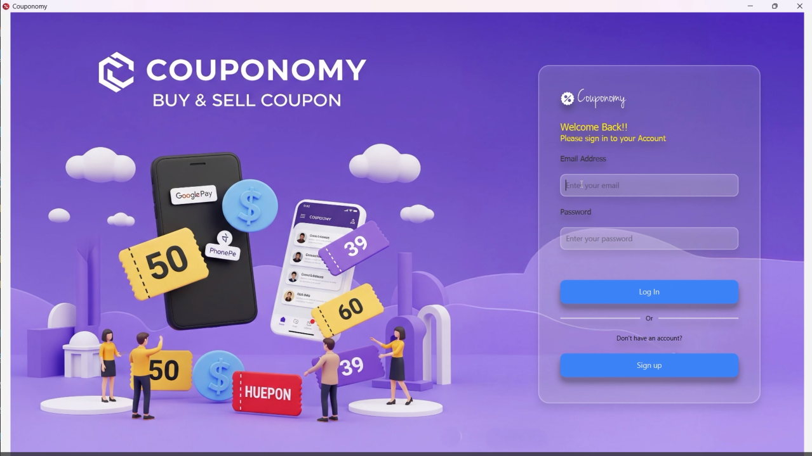
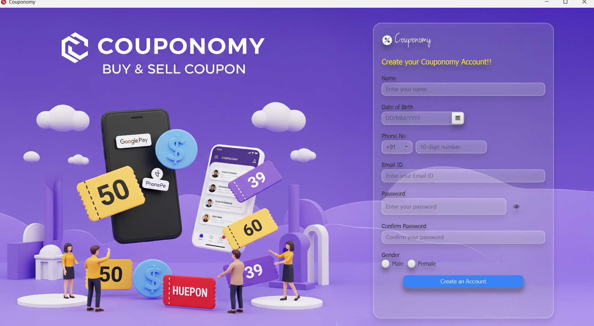
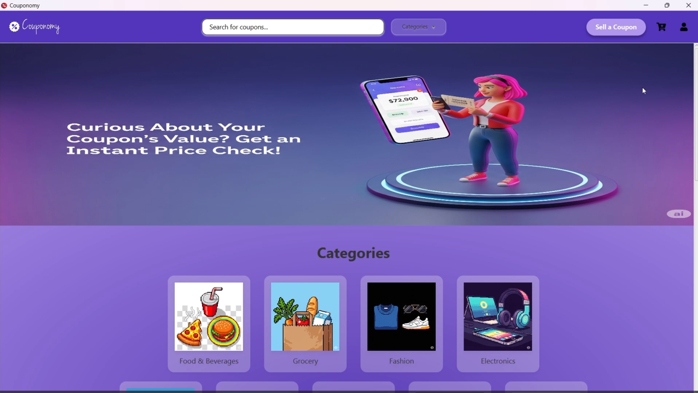
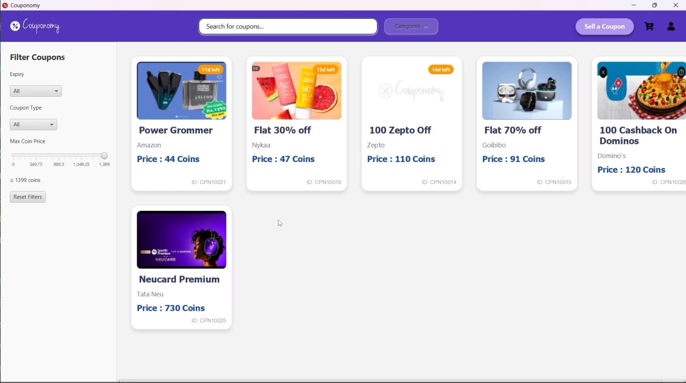
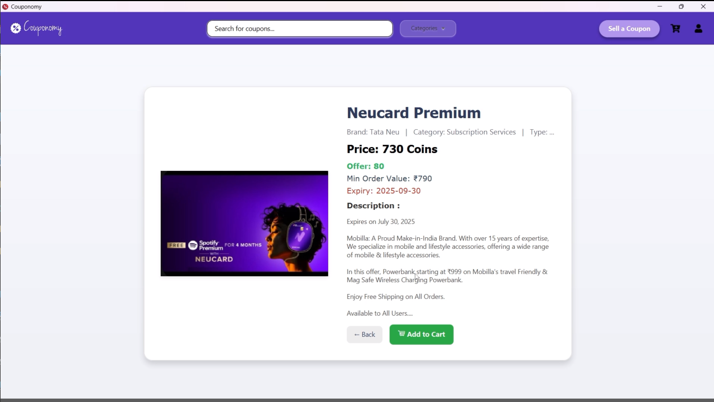
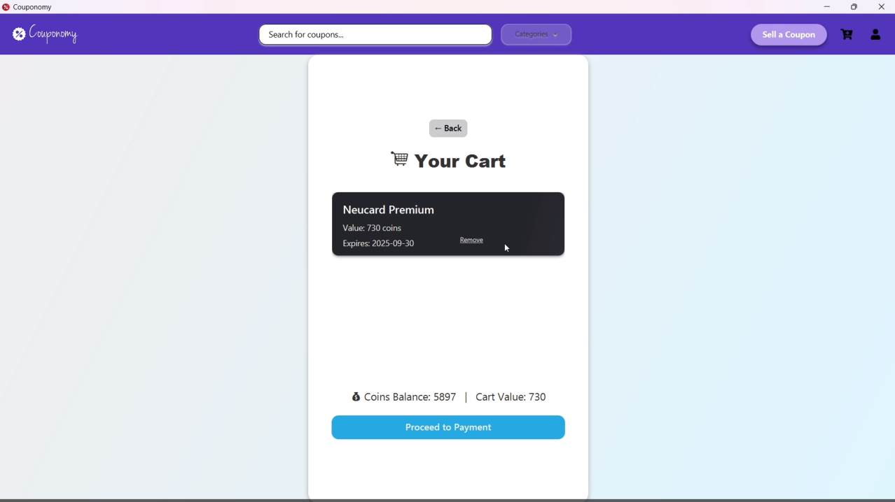
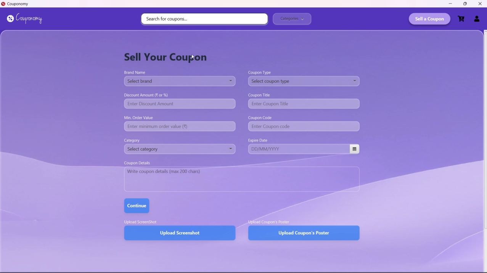
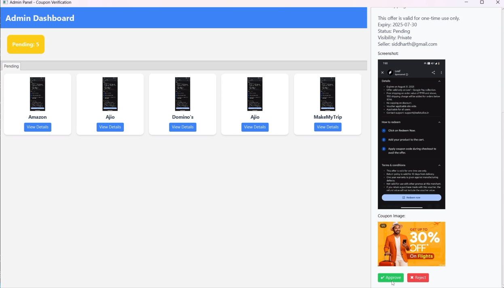
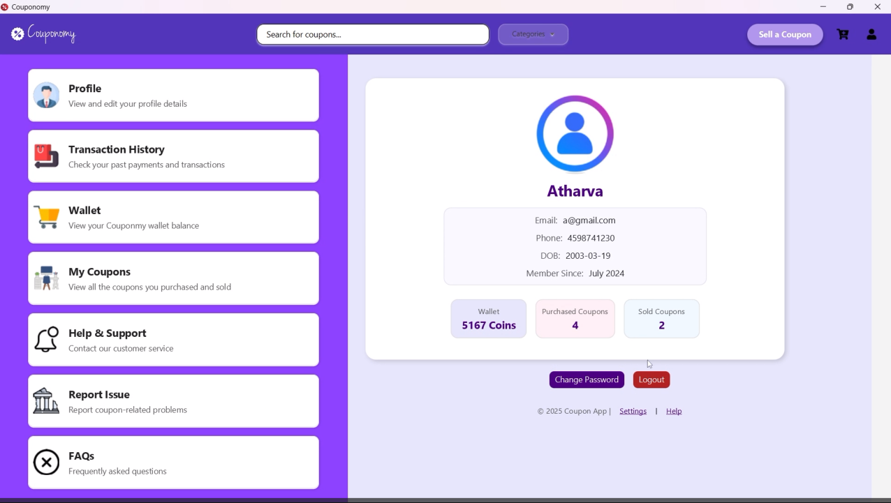

# Couponomy

## Smart Marketplace for UPI-Based Coupons

Couponomy is a JavaFX-based desktop application that enables users to upload and exchange unused UPI-based coupons using a virtual coin-based system. The platform helps reduce coupon wastage by allowing users to share valuable unused coupons with others in a secure and organized marketplace.

The application follows an admin verification workflow where uploaded coupons are reviewed before becoming publicly visible, ensuring authenticity and improving trust within the platform.

---

# Features

## Authentication & User Management
- User Registration & Login using Firebase Authentication
- Secure user account management
- Virtual wallet coin system

---

## Landing Page & Marketplace
- Dynamic landing page UI
- Coupon search functionality
- Categories dropdown menu
- Interactive image carousel
- Brand logo-based coupon navigation
- Category-wise coupon browsing
- Dynamic coupon marketplace

---

## Coupon Browsing & Filtering
- Browse coupons based on categories and brands
- Dynamic sidebar filters:
  - Filter by expiry date
  - Filter by coupon type
  - Filter by maximum coin price
- Real-time coupon listing updates
- Responsive coupon card interface

---

## Coupon Details & Cart System
- Detailed coupon information page
- Seller-provided coupon details display
- Add to Cart functionality
- Cart review system
- Coin balance tracking
- Cart value calculation
- Back navigation support

---

## Coupon Upload System
- Upload unused UPI-based coupons
- Upload coupon screenshots and promotional posters
- Firebase Storage integration for image handling
- Coupon submission workflow

---

# Admin Features

- Dedicated Admin Dashboard
- Coupon verification & moderation
- Approve or reject uploaded coupons
- Manage public coupon visibility
- Monitor uploaded coupon listings
- Ensure authenticity of coupons

---

# Tech Stack

## Frontend
- Java
- JavaFX

## Backend & Cloud Services
- Firebase Authentication
- Firebase Firestore Database
- Firebase Realtime Database
- Firebase Storage

## Architecture
- MVC (Model View Controller)

## Build Tool
- Maven

---

# Project Architecture

```plaintext
src/main/java/com/superx
│
├── Configuration
├── Controller
├── Dao
├── Model
├── View
└── Main.java
```

---

# Core Functionalities

## Smart Coupon Marketplace
Users can browse, search, filter, and purchase coupons using an interactive marketplace interface integrated with Firebase backend services.

---

## Dynamic Filtering System
The application dynamically filters coupons based on:
- Expiry date
- Coupon type
- Coin value range
- Categories
- Brands

This improves usability and helps users quickly discover relevant coupons.

---

## Virtual Coin Economy
Couponomy uses a virtual wallet coin system where:
- Users can purchase coupons using coins
- Coin balance is tracked dynamically
- Cart value updates in real time

---

## Coupon Verification Workflow

1. User uploads unused coupon
2. Coupon images are uploaded to Firebase Storage
3. Coupon details are stored in Firestore
4. Admin verifies uploaded coupons
5. Approved coupons become publicly visible
6. Users can purchase verified coupons

This workflow ensures authenticity and platform reliability.

---

# Firebase Services Used

| Firebase Service | Purpose |
|---|---|
| Firebase Authentication | User Login & Signup |
| Firestore Database | Coupon & User Data Storage |
| Realtime Database | Real-Time Features |
| Firebase Storage | Coupon Image Uploads |

---

# Key Highlights

- JavaFX-based desktop application
- Modern marketplace UI
- Dynamic filtering system
- Real-time backend integration
- Admin verification workflow
- Virtual wallet system
- Cloud-based coupon storage
- Secure Firebase Authentication
- Firebase Storage integration
- Structured MVC architecture

---

# Screenshots

> Add screenshots of the following sections:

- Login Page

- Registration Page

- Landing Page

- Category Blocks

- Coupon Details Page

- Cart System

- Coupon Upload Page

- Admin Dashboard

- Profile Page

- Coupon History


# Demo Video
  


# Installation & Setup

## Clone Repository

```bash
git clone https://github.com/your-username/Couponomy.git
```

---

## Open Project

Open the project in:
- Visual Studio Code
- IntelliJ IDEA

---

# Firebase Configuration

1. Create a Firebase project
2. Enable:
   - Authentication
   - Firestore Database
   - Realtime Database
   - Storage
3. Download Firebase Admin SDK JSON key
4. Place the key inside:

```plaintext
src/main/resources/
```

---

# Important Security Note

The Firebase Admin SDK private key file is excluded using `.gitignore` for security purposes.

---

# Install Dependencies

Dependencies are automatically managed using Maven.

---

# Run the Application

## Using Maven

```bash
mvn javafx:run
```

OR

Run `Main.java` directly from your IDE.

---

# Motivation

Many users receive discount coupons through UPI and payment applications but never use them. Couponomy aims to create a platform where such coupons can be reused effectively instead of expiring unused.

---

# Deployment

Couponomy is a JavaFX desktop application. Unlike web applications hosted on web servers, this project is packaged as an executable desktop application integrated with Firebase cloud backend services.

---

# Future Improvements

- AI-based coupon verification
- Fraud detection system
- Personalized coupon recommendations
- Notification system
- Mobile & Web platform expansion
- Advanced analytics dashboard

---

# Author

## Sakshi Patil

Computer Science Engineering Student  
Java | JavaFX | Firebase | Flutter

---

# License

This project is created for educational and learning purposes.